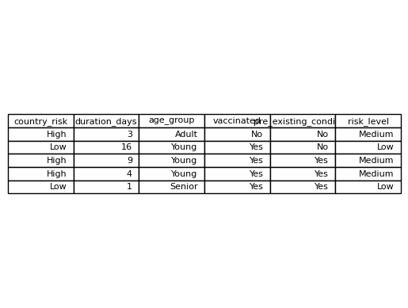
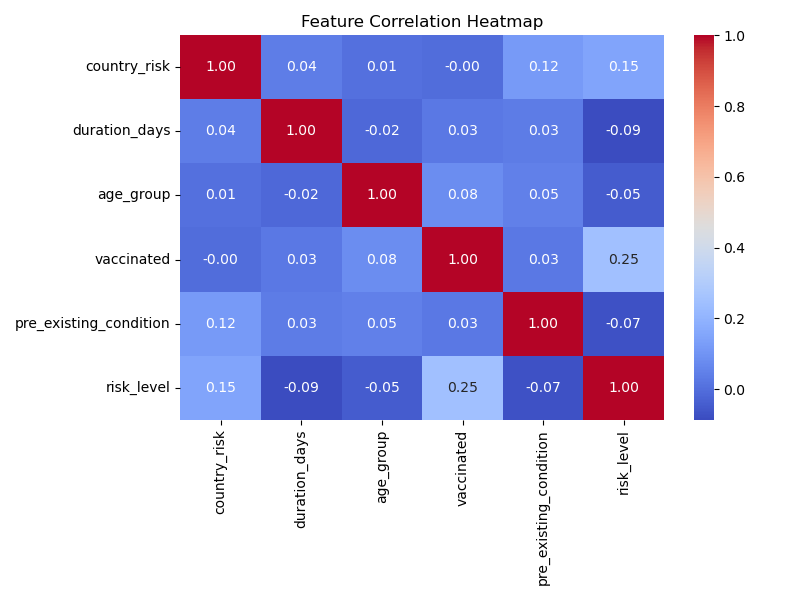
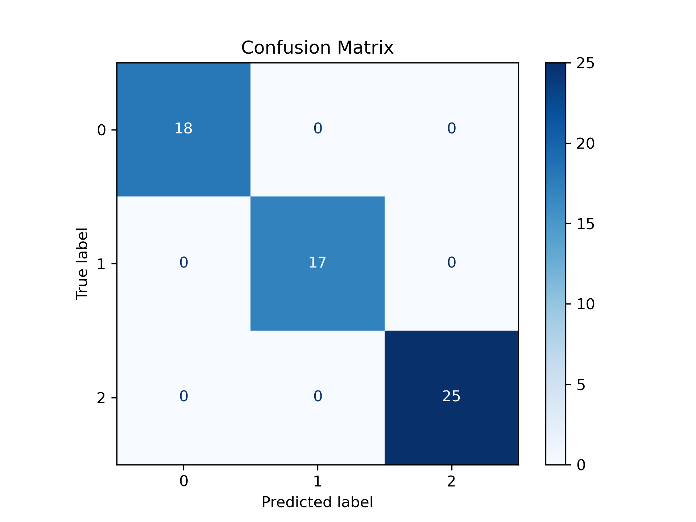

# AI-Based Health Risk Prediction System

## Introduction

The AI-Based Health Risk Prediction System predicts health risk levels using machine learning based on user inputs like travel history, health parameters, and demographics.

---

## Objectives

- Predict health risk levels  
- Enable early detection  
- Extract insights from data  
- Provide personalized recommendations  

---

## Methodology

### 1. Data Collection & Preprocessing

- Cleaned dataset  
- Handled missing values  
- Encoded categorical variables  

---

### 2. Exploratory Data Analysis (EDA)

- Generated correlation heatmaps  
- Identified patterns  

---

### 3. Model Training & Evaluation

- Trained classification models  
- Evaluated using standard metrics  

---

## Results

---

## Contact

Email: arshiyatyagii@gmail.com  
LinkedIn: https://www.linkedin.com/in/arshiyatyagi

